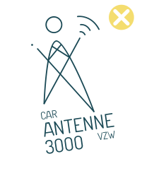
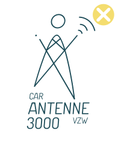
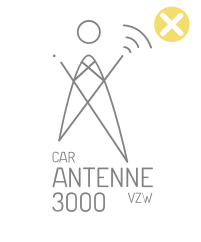
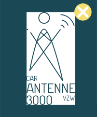

# Logo
***

Het logo wordt toegepast op alle communicatiedragers van Antenne 3000 vzw om zo de herkenbaarheid van Antenne 3000 te verhogen. Het logo is opgebouwd uit een beeldmerk en woordmerk 'CAR Antenne 3000 vzw', de volledige naam van de vzw. Het beeldmerk is een illustratie die een kind en antenne combineert. 

Het woordwerk 'CAR Antenne 3000 vzw' is de volledige naam van de organisatie en moest volledig in beeld gebracht worden in het logo. Aangezien dit veel tekst is voor één logo zijn de woorden zo gepositioneerd zodat sommige kleiner worden afgebeeld dan andere.

{: .w-25}

## ICOON

Het icoon is een illustratie van een kind, de doelgroep waarop Antenne zich focust en een antenne. Het geeft een gevoel dat het kind gevoelens uitstraalt, spreekt en in beweging is. 

{: .w-25}

## KLEUR

In het logo wordt de blauwgroene kleur gebruikt die als basis gebruikt wordt in de huisstijl. 

{: .w-100}

RGB | CMYK | HEX
------------ | ------------- | ------------ 
26-73-85 | 100-48-47-44 |#1A4955

## TYPOGRAFIE
  
Voor dit logo werd het font 'Dosis' als basis gebruikt. Dit werd nog bewerkt door de 'a' te vervormen en zo de ruimte meer op te vullen en een mooier geheel te creëeren.
  
  

## WAT NIET KAN

Er zijn enkele afspraken die we maken in verband met het logo. Hieronder worden ze verduidelijkt. Respecteer ten alle tijde deze parameters zodat het logo altijd mooi uitkomt. Onderstaande effecten mogen niet gebruikt worden in het logo.

    

    
    <h5  class="card-title">1.</h5>
    
Plaats het logo nooit in outlines. 

    

    
    <h5  class="card-title">2.</h5>
    
Verdraai het logo nooit. Het moet altijd in 90° staan. 

    

    

    
    <h5  class="card-title">3.</h5>
    
Vervorm het logo nooit. Het logo moet altijd 90° staan en mag in geen enkel geval vervormd worden.

    

 

    

    
    <h5  class="card-title">4.</h5>
    
Maak nooit aanpassingen in het beeldmerk. Het moet altijd één geheel blijven. 

    

    
    <h5  class="card-title">5.</h5>
    
Voeg nooit een slagschaduw toe. 

    

    

    
    <h5  class="card-title">6.</h5>
    
Verander het logo nooit van kleur.

    

